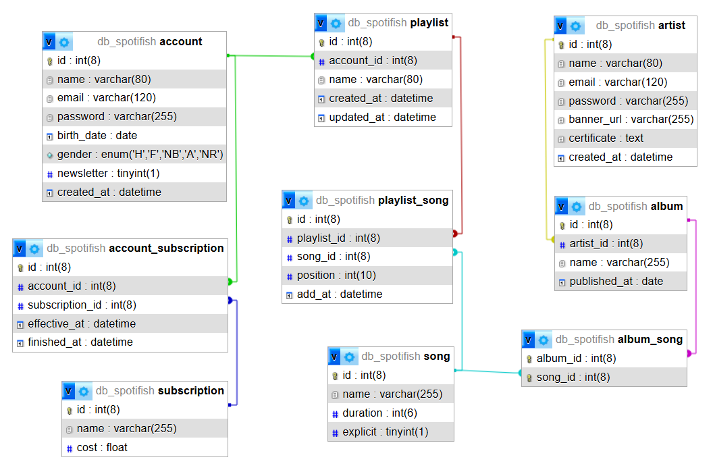

# Création de base de données

## 1. Créer une base de données

Vous devez créer une base de données de nom `db_spotifish`

## 2. Créer les tables

Votre script de création doit corespondre à ce schéma de base de données :



Pensez à bien conserver votre script !

Votre script doit pouvoir s'exécuter en **une seule fois**, ainsi la création de la base de données doit être la première ligne du script.

Voici l'instruction permettant de dire au SGBD "exécute les commandes dans cette base de données" :

```sql
USE `db_spotifish`;
```